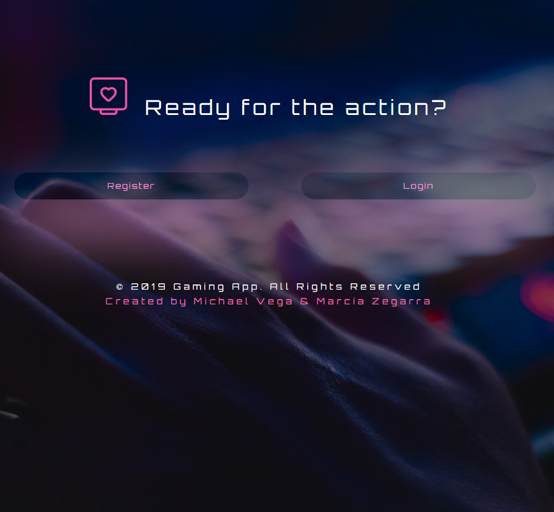

# University of Central Florida
### Coding Bootcamp 
#### Full Stack Developer 

- - -

### Bounty Hunter
A dynamic **video game** built inside a web application that uses a secure authentication system and saves the user’s information in a responsible and **encrypted** database.

**Overview Assignment**

Bounty Hunter is a web application that contains a game as a main user interaction behavior. It requires an user registration and log. The information is safety placed on a remote database built with add-ons on Heroku. 
- - - - 

##### Regarding of the code

*  Libraries and languages used for accomplished this assignment 

    #
    * __Front End__
        * HTML
        * CSS & Bootstrap
        * CodePen
        * Javascript
        * ReactJS
        * Redux
        ###
    * __Back End__
        * Node.js
        * Express
        * MongoDB
        * Mongoose
        * NPM

To learn more about Mongoose, click [here!](https://www.npmjs.com/package/mongoose)

### [Here you can execute my project](https://ucf-pr3.herokuapp.com/)

*If any suggestion, do not hesitate to contact me on my personal email: marcia.gzq@gmail.com
I would appreciate any comment, I know it may be very beneficial on my professional growth.*
